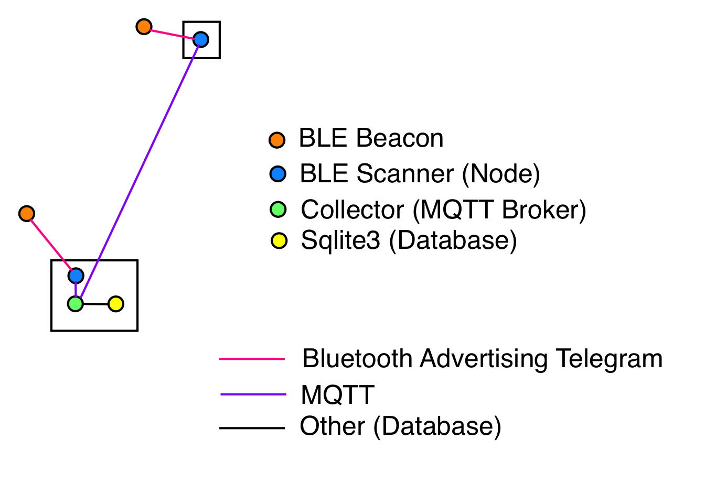
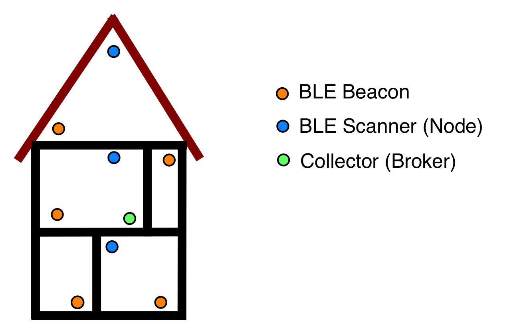

# Distributed BLE beacon scanner (for linux)

## System Description
This project is a distributed BLE beacon scanner consisting of several nodes which scans for BLE beacons advertising telegrams (filter could be applied) and send the received information via MQTT to a single broker. 
The aim of this setup is to cover a bigger house or flat and stores the relevant beacon information in one single database. See the following graphics for reference.

However, this project only collect beacon telegrams as well as the position (node) where the beacon is located and stores everything in a database. There is no further processing.

## Operations
The documentation of the node and broker scripts are located within the dedicated folders.
